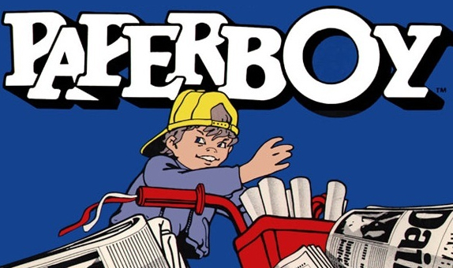

# Paperboy

Your tasked with emulating the following:

> A few news agencies wishes to deliver their papers to their customers.
> An agency can have many customers and a customer can have papers delivered from many agencies.

# Solution

In the given console application implement the requirements. You're allowed to change anything you like.

## What you'll be evaluated on

You'll be evaluated on your ability to write

- **easly** maintainable code
- using the correct pattern(s)
- **opholding** best practices
